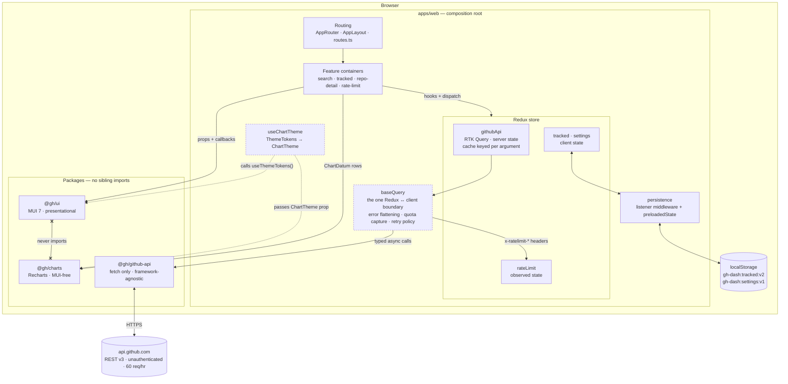
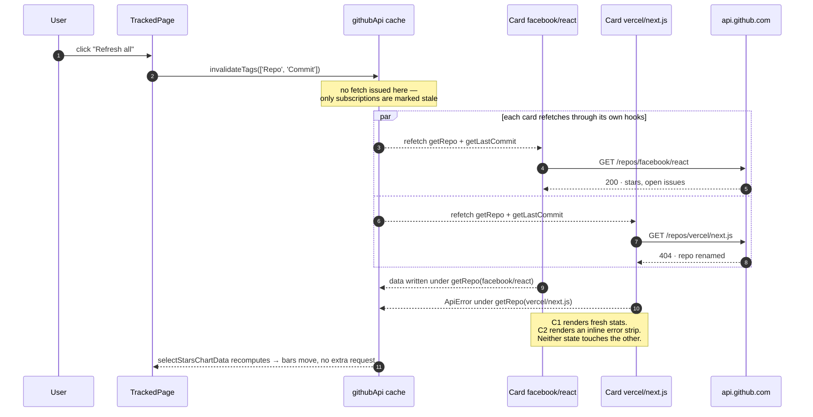
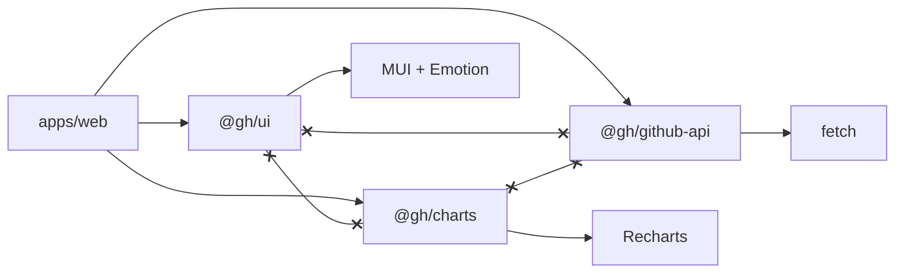

# GitHub Repo Dashboard

Search GitHub repositories, track favourites, and monitor their stars, open issues and last
commit date — with per-repo refresh and independent loading and error states.

**Live: [gh-dashboard-delta.vercel.app](https://gh-dashboard-delta.vercel.app)**

A pnpm + Turborepo monorepo: one deployable SPA and four packages, with a one-way
dependency graph enforced at lint time.

|                     |                                                                                            |
| ------------------- | ------------------------------------------------------------------------------------------ |
| **Stack**           | React 19 · TypeScript 5.7 (strict) · Redux Toolkit + RTK Query · MUI 7 · Recharts · Vite 6 |
| **Data source**     | GitHub REST API v3 (`api.github.com`), unauthenticated                                     |
| **Package manager** | pnpm 10.25.0 (workspaces)                                                                  |
| **Task runner**     | Turborepo 2.3                                                                              |
| **Deploy target**   | Vercel (static SPA) — [live deployment](https://gh-dashboard-delta.vercel.app)             |

---

## Table of contents

1. [Architecture](#1-architecture)
2. [Dependency-direction rules](#2-dependency-direction-rules)
3. [Decisions and trade-offs](#3-decisions-and-trade-offs)
4. [Local setup](#4-local-setup)
5. [Deploy notes](#5-deploy-notes)

---

## 1. Architecture

### Workspace layout

```
apps/web              Vite + React 19 SPA — the only deployable
packages/config       @gh/config     — shared tsconfig / eslint / prettier bases
packages/github-api   @gh/github-api — REST client + domain types (no React, no Redux)
packages/ui           @gh/ui         — MUI design system, presentational only
packages/charts       @gh/charts     — Recharts wrappers, MUI-free
```

### Component and data flow



Two boundaries carry the design (drawn dashed above):

- **`baseQuery`** is the only place `@gh/github-api` meets Redux. It performs requests
  described as values, flattens the client's thrown error classes into a serializable
  `ApiError`, records quota from every response's headers, and decides retry vs. bail-out.
- **`useChartTheme`** is the only place the two design systems meet. It maps `@gh/ui`'s
  `useThemeTokens()` onto the `ChartTheme` object `@gh/charts` accepts, which is what lets
  charts render under the MUI theme without importing MUI.

### Data flow: "Refresh all"

The clearest illustration of per-entity independence — the button lives on the page, the
queries live on the cards, and nothing is coordinated between them.



### Routes

| Route                | What it does                                                             |
| -------------------- | ------------------------------------------------------------------------ |
| `/`                  | Debounced search, track/untrack per row, paging                          |
| `/tracked`           | One card per tracked repo, per-card refresh, "Refresh all", stars chart  |
| `/repo/:owner/:name` | Detail view — stats, languages, contributors, each loading independently |
| `*`                  | Not found; issues no requests                                            |

All routes are imported eagerly. Splitting the detail route out measured at ~15 kB gzip off a
332 kB bundle — Recharts is the bulk of the weight and the tracked page's stars chart loads it
anyway, so there was nothing worth deferring.

### State model

Three categories, deliberately kept apart:

| Category           | Slices                  | Owner            | Persisted                      |
| ------------------ | ----------------------- | ---------------- | ------------------------------ |
| **Server state**   | `githubApi` (RTK Query) | GitHub           | No — cache only                |
| **Client state**   | `tracked`, `settings`   | This app         | Yes — versioned `localStorage` |
| **Observed state** | `rateLimit`             | Response headers | No                             |

The tracked slice holds **references only** — `{ id, owner, name }`. Every renderable
number lives in the query cache under the same id. See
[ADR-003](#adr-003-tracked-repos-are-references-not-snapshots).

---

## 2. Dependency-direction rules

The graph is **one-way and acyclic**. `apps/web` is the composition root; packages are
leaves that know nothing about each other or about the app.



### The rules

1. **`apps/web` may import any package. No package may import `apps/web`.**
   The app is the only place a store, a router and a design system are allowed to meet.

2. **No package may import a sibling package.**
   `@gh/ui`, `@gh/charts` and `@gh/github-api` are mutually invisible. Where two of them
   need to agree on a shape, the shape is declared structurally on both sides and the app
   passes values across — `@gh/ui` declares its own `RepoCardRepo` rather than importing
   `RepoSummary`, and the domain type happens to satisfy it.

3. **`apps/web` may not reach past a package to that package's substrate.**
   No `recharts` behind `@gh/charts`; no `@mui/*` or `@emotion/*` behind `@gh/ui`. Anything
   the app needs from MUI is re-exported by `@gh/ui` under a name of ours. This keeps the
   design system swappable and guarantees a single MUI instance in the bundle.

4. **Layer-specific prohibitions** — each package forbids the substrate of the layers above
   it:

   | Package          | Must never import                                                                  | Why                                                                                                                                                                 |
   | ---------------- | ---------------------------------------------------------------------------------- | ------------------------------------------------------------------------------------------------------------------------------------------------------------------- |
   | `@gh/ui`         | `redux`, `@reduxjs/*`, `react-redux`, `react-router*`, `recharts`, siblings, `web` | Presentational only. Components take props and emit callbacks; a component must not know a store exists. The router's `Link` is injected as a `linkComponent` prop. |
   | `@gh/charts`     | `@mui/*`, `@emotion/*`, `redux`, `@reduxjs/*`, `react-router*`, siblings, `web`    | Theme-agnostic by contract: the consumer passes a `ChartTheme` object. Also free of GitHub vocabulary — a chart takes `{ label, value, id? }` rows.                 |
   | `@gh/github-api` | `react`, `react-*`, `redux`, `@reduxjs/*`, siblings, `web`                         | Transport layer: pure async functions plus domain types. Usable from a CLI, a test or a server with no changes.                                                     |
   | `apps/web`       | `recharts*`, `@mui/*`, `@emotion/*`                                                | Rule 3.                                                                                                                                                             |

5. **Unidirectional data flow inside the app.**
   Containers read through hooks and selectors and dispatch actions; presentational
   components never dispatch. Reducers stay pure — persistence is a listener middleware, not
   a reducer side effect, so time-travel debugging and StrictMode's double-invoke still mean
   something.

### How the rules are enforced

Three layers, so a violation cannot reach `main`:

- **pnpm strict `node_modules`** — an _undeclared_ cross-package import fails at
  install/build time. A package can only import what its own `package.json` lists.
- **`forbidImports()` ESLint rule** (`packages/config/eslint.base.js`) — catches the case
  pnpm cannot: someone declares the dependency in order to make the import work. Each
  package passes its own prohibition list (the table above) and violations fail `lint` with
  `Dependency-direction violation: this package must not import "…"`.
- **CI + pre-commit** — `pnpm turbo run lint typecheck` runs on every commit via Husky, and
  the full graph runs on every push and pull request.

---

## 3. Decisions and trade-offs

### Summary

| #                                                                    | Decision                                          | Trade-off accepted                                                        |
| -------------------------------------------------------------------- | ------------------------------------------------- | ------------------------------------------------------------------------- |
| [001](#adr-001-pnpm-workspaces--turborepo)                           | pnpm workspaces + Turborepo                       | More config than a single app; no remote cache configured yet             |
| [002](#adr-002-rtk-query-owns-server-state)                          | RTK Query owns all server state                   | Ties the data layer to Redux; RTK Query's cache semantics must be learned |
| [003](#adr-003-tracked-repos-are-references-not-snapshots)           | Tracked repos stored as references                | A cold load shows skeletons until the first fetch returns                 |
| [004](#adr-004-persistence-as-listener-middleware-not-redux-persist) | Hand-rolled versioned persistence                 | ~180 lines to own instead of a dependency                                 |
| [005](#adr-005-two-sibling-design-systems-that-never-meet)           | `@gh/ui` and `@gh/charts` never import each other | One mapping file, and duplicated structural prop types                    |
| [006](#adr-006-unauthenticated-github-client)                        | Unauthenticated GitHub client                     | Hard ceiling of 60 core requests/hour                                     |
| [007](#adr-007-custom-basequery-with-flattened-errors)               | Custom `baseQuery` + serializable `ApiError`      | Loses `instanceof`; adds a mapping function to maintain                   |
| [008](#adr-008-refresh-all-is-tag-invalidation)                      | "Refresh all" = tag invalidation                  | No central progress bar or concurrency limit                              |

### ADR-001: pnpm workspaces + Turborepo

**Decision.** pnpm workspaces for package resolution, Turborepo for the task graph.

**Why.** pnpm's strict, non-flat `node_modules` is load-bearing here: it is the first line
of enforcement for the dependency rules in §2, which npm or Yarn's hoisting would silently
defeat. Turborepo adds content-hash caching, so an unchanged package is skipped — the
pre-commit hook can afford to run `lint typecheck` repo-wide rather than on staged files
only, which matters because a type error is usually in a _caller_ that was not staged.

**Trade-off.** More moving parts than a single Vite app would need at this size. Turborepo's
remote cache is not configured, so CI starts cold on every run (~6 s locally when warm).

### ADR-002: RTK Query owns server state

**Decision.** Everything fetched from GitHub lives in RTK Query. No slice holds a copy.

**Why.** The brief asks for "independent loading and error states per repo". RTK Query keys
its cache **per argument**, so `getRepo({ owner: 'facebook', name: 'react' })` owns its own
`isFetching`, `error` and `data` for free. The alternative — a hand-rolled
`Record<repoId, LoadingState>` — is the same feature, except every reducer then has to keep
it consistent and every new endpoint has to remember to.

`getRepo`'s cache key is pinned explicitly to `getRepo(owner/name)` rather than left to
default argument serialisation, because the tracked slice stores only references: the stars
chart has to find a repo's cache entry from an id alone. A key spelled out once is a
contract; a key reverse-engineered from `JSON.stringify` ordering is a bug in waiting.

**Trade-off.** Couples the data layer to Redux. A future move to TanStack Query would be a
rewrite of `store/api`, though `@gh/github-api` beneath it would not change — which is
exactly why the client package has no framework dependency.

### ADR-003: Tracked repos are references, not snapshots

**Decision.** A tracked entry is `{ id, owner, name }`. Nothing else.

**Why.** An earlier version stored the full repo — stars, description, default branch. That
produced two sources of truth for one repo, a `localStorage` write on every card refresh
(and `setItem` is synchronous, on the main thread), and a persisted `stars: 41200` that was
wrong by the next morning. Which repos the user follows is the one fact this app owns;
everything else belongs to GitHub and is re-fetchable.

The slice is normalised as `{ ids, entities }` so a repo can be found or removed by id
without walking an array, and `ids` alone carries render order.

**Trade-off.** A cold load has nothing to show until the first round of requests returns —
cards render skeletons rather than stale-but-instant numbers. Accepted: stale numbers
presented as current are worse than an honest skeleton, and the stars chart omits an
unloaded repo rather than plotting it at zero, because a bar at zero reads as "no stars",
which is a different claim from "not loaded".

### ADR-004: Persistence as listener middleware, not redux-persist

**Decision.** Writes go through `createListenerMiddleware`; reads feed `preloadedState` at
boot. Storage format is a version-stamped envelope under a versioned key.

**Why.**

- _Middleware, not a reducer side effect_ — reducers stay pure.
- _Matched to two slices only_ — RTK Query dispatches dozens of actions per search, and each
  one would otherwise stringify the whole list synchronously. Debounced 300 ms on top, so
  tracking five repos quickly is one write.
- _`preloadedState`, not a post-mount `hydrate` action_ — the very first render is already
  correct, with no flash of an empty list and no "is this loading or genuinely empty?"
  ambiguity for the UI to resolve.
- _Validate everything, discard on doubt_ — persisted data is untrusted input: hand-editable
  in DevTools, writable by an older build, truncatable by a tab killed mid-write. The failure
  mode is unusually nasty, because bad data that crashes boot reloads with the page and
  bricks the app until the user clears site data by hand. Individual malformed entries are
  dropped rather than the whole list — losing fourteen good repos because the fifteenth is
  broken would be the wrong trade.
- _Version in the key **and** in the payload_ — the key routes a new build away from old
  data; the payload version catches a blob that disagrees with the key it was found under.

**Trade-off.** ~180 lines of validation and migration code to own rather than a dependency.
Justified by the schema being two small shapes, and by the boot-crash failure mode being
worth hand-holding.

### ADR-005: Two sibling design systems that never meet

**Decision.** `@gh/ui` (MUI) and `@gh/charts` (Recharts) are independent packages with no
import between them. Charts accept a plain `ChartTheme` object.

**Why.** A chart package that imports MUI is a chart package that can only be used in a MUI
app. Taking a flattened theme object instead means `@gh/charts` renders correctly under this
app's light/dark themes while remaining reusable anywhere. `@gh/ui` exposes
`useThemeTokens()` for exactly this purpose, and the two meet in one file:
`apps/web/src/app/useChartTheme.ts`.

The same rule removes GitHub vocabulary from the charts: they take `{ label, value, id? }`
rows and hand an `id` back on click. Sorting, formatting and what a click _means_ are all
the caller's, because only the caller knows whether the order carries information.

**Trade-off.** Prop shapes are duplicated structurally instead of shared (`RepoCardRepo` in
`@gh/ui` vs. `RepoSummary` in `@gh/github-api`). Accepted deliberately — the duplication is
what buys the independence, and TypeScript's structural typing means a container passes one
straight through.

### ADR-006: Unauthenticated GitHub client

**Decision.** No token is sent. The client is anonymous.

**Why.** A browser SPA cannot hold a secret. A user-supplied Personal Access Token would
have to live in `localStorage`, which is XSS-readable, and a server-side proxy is out of
scope for a static deploy.

**Trade-off — the binding constraint on the whole app.** 60 core requests/hour, plus a
separate 10 requests/minute bucket for search. A tracked list of fifteen repos costs
30 requests per "Refresh all" — roughly two full refreshes an hour.

Mitigated rather than ignored:

- a live rate-limit chip in the header, fed by `x-ratelimit-*` response headers on every
  request, so the budget is visible and costs nothing to display;
- search debounced on the _argument_ (400 ms) with a two-character minimum, so intermediate
  keystrokes never become requests;
- `refetchOnMountOrArgChange`, `refetchOnFocus` and `refetchOnReconnect` all **off** — a
  refetch on every tab focus would spend the budget re-fetching what is already on screen;
- per-endpoint cache lifetimes (search 60 s, repo data 300 s);
- retry bail-out on anything a second attempt cannot fix — retrying a 404 or a spent quota
  only burns the remainder.

**Exit path,** if the ceiling becomes binding: optional token support (a field whose value
never leaves `localStorage`, sent as an `Authorization` header) lifts the limit to 5,000/hr;
conditional requests with `If-None-Match` are the other half, since a `304` is not billed at
all. `packages/github-api/src/http.ts` is where both would land, and notes them as deferred.

### ADR-007: Custom `baseQuery` with flattened errors

**Decision.** One custom `baseQuery` rather than per-endpoint `queryFn`s. Endpoints describe
requests as values (`{ type: 'getRepo', ref }`); the baseQuery performs them.

**Why.** Three behaviours are cross-cutting and belong in exactly one place: quota capture,
error flattening, and retry policy. `@gh/github-api` throws typed class instances
(`NotFoundError`, `RateLimitError`, …), but a Redux store may only hold plain data —
`instanceof` survives neither the store nor DevTools serialisation. So the boundary flattens
the hierarchy into a tagged `ApiError { kind, message, status?, resetAt?, retryable }`, and
everything downstream switches on `kind`: the `retry` wrapper reads `retryable`, and the UI
copy reads `kind` to choose a title, a severity and whether to offer a retry button.

**Trade-off.** A mapping function (`toApiError`) that must be extended whenever a new error
class is added. Cheap, and exhaustively typed.

### ADR-008: "Refresh all" is tag invalidation

**Decision.** The button dispatches `githubApi.util.invalidateTags(['Repo', 'Commit'])`. It
does not fetch.

**Why.** The button is on the page and the queries are on the cards. Invalidating tags makes
RTK Query re-run exactly the subscriptions the cards hold, so each card refetches through its
_own_ hooks — which is precisely what keeps its spinner and its error its own. An imperative
fan-out from the page would have to funnel results back down and would collapse fifteen
independent states into one.

**Trade-off.** No central progress indicator, and no concurrency limit — the fan-out is as
wide as the tracked list. Browsers cap concurrent connections per host at around six, so a
long tracked list queues rather than stampedes; a bounded refresh queue is the fix if that
ceiling ever becomes visible.

---

## 4. Local setup

### Prerequisites

| Tool    | Version     | Notes                                                          |
| ------- | ----------- | -------------------------------------------------------------- |
| Node.js | **≥ 20.19** | Enforced by the root `engines` field                           |
| pnpm    | **10.25.0** | Pinned via `packageManager`; `corepack enable` will install it |
| Git     | any recent  | —                                                              |

```bash
corepack enable          # makes pnpm 10.25.0 available from the pinned field
node --version           # expect v20.19+ or v22+
```

### Environment variables

**There are none.** The app talks to `api.github.com` anonymously and reads no
`import.meta.env` values, so there is no `.env` file to create and nothing to configure
before it runs. If token support is ever added (see [ADR-006](#adr-006-unauthenticated-github-client)),
the token belongs in `localStorage` at runtime — not in a build-time variable, which would
be baked into the public bundle.

### Install and first build

```bash
git clone https://github.com/nehalabdelkader/gh-dashboard.git
cd gh-dashboard
pnpm install

# Required once after a fresh clone, before `dev`:
pnpm turbo run build --filter=@gh/github-api
```

> **Why the extra build step.** `@gh/ui` and `@gh/charts` declare a `development` export
> condition, so Vite resolves them straight to `src` and edits hot-reload without a rebuild.
> `@gh/github-api` does not — it resolves to `dist`. Turborepo's `dev` task has no
> `dependsOn: ["^build"]`, so a fresh clone that goes straight to `dev` will fail to resolve
> the client package. Running the full `pnpm turbo run build` once works equally well.

### Start the dev server

```bash
pnpm --filter web dev        # http://localhost:5173
```

Edits to `apps/web`, `@gh/ui` and `@gh/charts` hot-reload. Edits to `@gh/github-api` require
`pnpm turbo run build --filter=@gh/github-api` (or run it in a second terminal with
`--watch`).

### Verify a change

```bash
pnpm format:check                            # Prettier, repo-wide
pnpm turbo run lint typecheck build          # the full graph, content-hash cached
```

This is exactly what CI runs. Both are also wired into the pre-commit hook via Husky:
lint-staged rewrites and re-stages the staged files, then `turbo run lint typecheck` runs
repo-wide — deliberately not scoped to staged files, since changing an exported signature
breaks callers that were never staged.

### Running tests

**There is no test suite.** `pnpm test`
does not exist, and `turbo.json` has no `test` task.

To reintroduce one:

```bash
pnpm --filter web add -D vitest jsdom @testing-library/react \
  @testing-library/dom @testing-library/jest-dom
```

then add a `test` task to `turbo.json`, a `test` script to `apps/web/package.json`, restore
the `test` block in `apps/web/vite.config.ts` (switching the import back to
`vitest/config`), add `vitest/globals` and `@testing-library/jest-dom` to the app's tsconfig
`types`, and re-add the step to `.github/workflows/ci.yml`. **Any test that renders a chart
needs a `ResizeObserver` stub in the setup file** — jsdom has none, and Recharts'
`ResponsiveContainer` throws without it. That single omission is what broke the previous
suite.

### Other commands

| Command                               | Effect                                             |
| ------------------------------------- | -------------------------------------------------- |
| `pnpm format`                         | Prettier `--write`, repo-wide                      |
| `pnpm --filter web build`             | Typecheck then production build to `apps/web/dist` |
| `pnpm --filter web preview`           | Serve the production build locally                 |
| `pnpm clean`                          | Remove every `dist`, `.turbo` and `node_modules`   |
| `pnpm turbo run lint --filter=@gh/ui` | Scope any task to one package                      |

---

## 5. Deploy notes

### Environments

| Environment    | Trigger                                       | URL                                                                    |
| -------------- | --------------------------------------------- | ---------------------------------------------------------------------- |
| **Production** | Push / merge to `main`                        | [gh-dashboard-delta.vercel.app](https://gh-dashboard-delta.vercel.app) |
| **Preview**    | Every pull request and non-`main` branch push | Per-deployment URL, commented by Vercel on the PR                      |
| **Local**      | `pnpm --filter web dev`                       | `http://localhost:5173`                                                |

There is no staging environment. Preview deployments serve that role: each PR gets a fully
built, independently addressable copy against the same live GitHub API.

### Vercel project configuration

Two settings live in the Vercel dashboard and are **not** in the repository — both must be
set, or the build fails:

| Setting             | Value                                                   |
| ------------------- | ------------------------------------------------------- |
| **Root Directory**  | `apps/web`                                              |
| **Node.js Version** | 20.x or 22.x (must satisfy the root `engines: >=20.19`) |

Everything else is checked in, at [`apps/web/vercel.json`](apps/web/vercel.json):

```jsonc
{
  "buildCommand": "cd ../.. && pnpm turbo run build --filter=web...",
  "outputDirectory": "dist",
  "framework": null,
  "github": { "silent": true },
  "rewrites": [{ "source": "/(.*)", "destination": "/index.html" }],
}
```

Three things this does, each of which matters:

- **Steps up to the workspace root** so Turborepo runs the _filtered_ build
  (`--filter=web...`, with the trailing `...` meaning "web and everything it depends on").
  Building from `apps/web` alone would not build the packages.
- **`framework: null`** — Vercel's Vite preset would try to build from the root directory
  and ignore the Turborepo graph.
- **The SPA rewrite** is what makes a deep link such as `/repo/facebook/react` work on a
  cold load. Without it, the CDN looks for a file at that path and returns 404. This is the
  single most common post-deploy failure for this app — verify it explicitly.

pnpm installs from the workspace root automatically, so `@gh/config` and the sibling
packages resolve without extra configuration.

### CI/CD pipeline

[`.github/workflows/ci.yml`](.github/workflows/ci.yml) — the correctness gate, independent
of Vercel:

|                 |                                                                                                |
| --------------- | ---------------------------------------------------------------------------------------------- |
| **Triggers**    | `push` to `main`; every `pull_request`                                                         |
| **Concurrency** | Grouped per workflow + ref, `cancel-in-progress: true` — a new push cancels the in-flight run  |
| **Runner**      | `ubuntu-latest`, Node 22, pnpm via `pnpm/action-setup@v4`, pnpm cache on                       |
| **Steps**       | `pnpm install --frozen-lockfile` → `pnpm format:check` → `pnpm turbo run lint typecheck build` |

Vercel builds independently and in parallel on the same events. **CI is not a gate on the
Vercel deployment** — a preview will publish even if lint fails. Enable "Require status
checks to pass" on the `main` branch protection rule if production deploys must be gated.

`github.silent: true` suppresses Vercel's commit-status comments; PR preview links still
appear.

### Configuration management

| Concern                     | Where it lives                                                                            |
| --------------------------- | ----------------------------------------------------------------------------------------- |
| Environment variables       | **None** — nothing to manage, rotate or leak                                              |
| Secrets                     | **None** — the GitHub client is unauthenticated                                           |
| Node / pnpm versions        | Root `engines` and `packageManager`; mirrored in the CI workflow and the Vercel dashboard |
| Build configuration         | `apps/web/vercel.json`, `turbo.json`, `apps/web/vite.config.ts` — all version-controlled  |
| Native build approvals      | `onlyBuiltDependencies: [esbuild]` in `pnpm-workspace.yaml`                               |
| Client-side persisted state | Versioned `localStorage` keys — see the rollback note below                               |

The absence of secrets is deliberate and is the main operational benefit of
[ADR-006](#adr-006-unauthenticated-github-client): there is no credential in the pipeline to
rotate, scope or accidentally publish.

### Post-deploy verification

No automated smoke tests exist, so run this checklist against
[gh-dashboard-delta.vercel.app](https://gh-dashboard-delta.vercel.app) after a production deploy. It takes about two minutes and
covers every path that can break in production but not locally.

1. **Cold load of `/`** — the search page renders; no console errors.
2. **Deep link** — open `/repo/facebook/react` _directly_ in a new tab. It must render the
   detail page, not a 404. **This is the SPA-rewrite check and the most likely failure.**
3. **Search** — type `react`; results appear after the pause, not per keystroke. Network tab
   shows one request, not one per character.
4. **Track** — track two repos; both appear on `/tracked` with stars, open issues and a last
   commit date.
5. **Persistence** — hard-reload `/tracked`. Both repos are still listed, and present on the
   first paint rather than after a flash of the empty state.
6. **Per-repo independence** — refresh one card; only that card shows a spinner.
7. **Refresh all** — the chart bars update along with the cards.
8. **Rate-limit chip** — shows a live remaining count in the header, decreasing as requests
   are made.
9. **Theme** — toggle light/dark/system; reload. The choice survives, with no flash of the
   wrong theme.
10. **Unknown route** — `/nope` renders the not-found page and issues no requests.

If step 3 or step 8 shows a `403`, the deployment is fine and the shared egress IP has simply
exhausted its anonymous quota — check the chip's reset time before investigating further.

### Rollback

**Fastest path (seconds, no rebuild):** Vercel dashboard → Deployments → select the last
known-good deployment → **Promote to Production** (Instant Rollback). This repoints the
alias at an already-built artifact.

**Durable path:** `git revert <sha>` and push to `main`. Redeploys through the normal
pipeline, and leaves the history honest.

**One thing to know before rolling back.** Persisted state is keyed by schema version
(`gh-dash:tracked:v2`, `gh-dash:settings:v1`), and a version bump **orphans** the old blob
rather than deleting it. That is deliberate: a rolled-back build reads the key it expects and
finds its own data intact, so a user's tracked list survives a round trip in both directions.
If a future change bumps `TRACKED_SCHEMA_VERSION`, note in the release that rolling _forward_
again will not migrate data written by the rolled-back build unless a `parseLegacy…` path is
added — `parseLegacyTrackedState` in
[`schema.ts`](apps/web/src/store/persistence/schema.ts) is the worked example of that
migration for v1→v2.

**Static-asset note.** The build emits content-hashed filenames, so a rollback cannot leave a
client holding a stale `index.html` that points at deleted chunks for longer than the CDN's
own propagation. No cache purge is needed.
